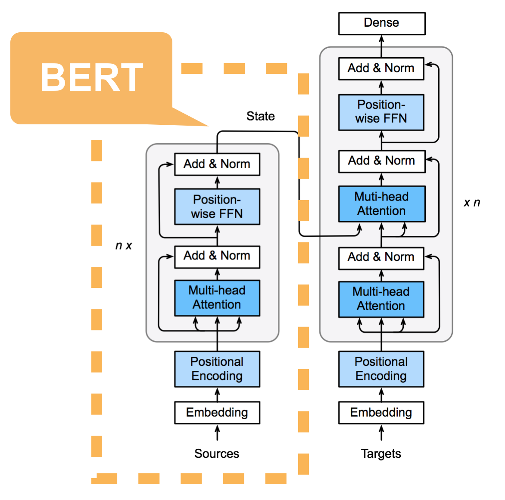

# BERT Pre-training and Fine-tuning

In this notebook, you will understand how to implement the BERT model for pre-training, and to fine-tune a pre-trained BERT model for sentiment analysis.


## Preparation

First, let's import necessary modules.

Note that utils.py includes some Blocks defined in the previous transformer notebook

```{.python .input  n=1}
import random, math

import d2l
import numpy as np
import mxnet as mx
from mxnet import gluon, nd
import gluonnlp as nlp

from utils import PositionalEncoding, MultiHeadAttention 
from utils import AddNorm, PositionWiseFFN, EncoderBlock
from utils import train_loop, predict_sentiment
```

### Encoder

Different from the transformer encoder, the BERT encoder has an additional embedding for segment information.




### Segment Embedding


Similar to the Transformer encoder defined in the previous section, the BERT encoder has embeddings for words and positions. The `EncoderBlock` contains position-wise feed-forward network and self-attention blocks to encode inputs. For BERT, the newly added segment embedding captures the segment information of the input sentence pairs, used for the next sentence prediction task.

### BERT Encoder Definition

```{.python .input  n=2}
class BERTEncoder(gluon.nn.Block):
    def __init__(self, vocab_size, units, hidden_size,
                 num_heads, num_layers, dropout, **kwargs):
        super(BERTEncoder, self).__init__(**kwargs)
        # segment_embed for segment information
        self.segment_embed = gluon.nn.Embedding(2, units)
        self.word_embed = gluon.nn.Embedding(vocab_size, units)
        self.pos_encoding = PositionalEncoding(units, dropout)
        self.blks = gluon.nn.Sequential()
        for i in range(num_layers):
            self.blks.add(EncoderBlock(units, hidden_size, num_heads, dropout))

    def forward(self, words, segments, mask, *args):
        X = self.word_embed(words) + self.segment_embed(segments)
        X = self.pos_encoding(X)
        for blk in self.blks:
            X = blk(X, mask)
        return X
```

### Using BERT Encoder

Now let's test the BERTEncoder with a data batch of 2 sentence pairs, each with 8 words. Random integers are used to represent words for demonstration purpose. For segment information, we use 0 to indicate the word comes from the first sentence, 1 to indicate the second setence.

```{.python .input  n=3}
encoder = BERTEncoder(vocab_size=30000, units=768, hidden_size=3072,
                      num_heads=12, num_layers=12, dropout=0.1)
encoder.initialize()

num_samples, num_words = 2, 8
# random words for testing
words = nd.random.randint(low=0, high=30000, shape=(num_samples, num_words))
# the corresponding segment information for each word
segments = nd.array([[0,0,0,0,1,1,1,1],[0,0,0,1,1,1,1,1]])

encodings = encoder(words, segments, None)
print(encodings.shape) # (batch_size, num_words, units)
```

```{.json .output n=3}
[
 {
  "name": "stdout",
  "output_type": "stream",
  "text": "(2, 8, 768)\n"
 }
]
```

### Next Sentence Classifier


Let us take a look at the first pre-training task: next sentence prediction. For this task, the encoding of the first token (the "[CLS]" token) is passed to a feed-forward network to make prediction.

```{.python .input  n=4}
class NSClassifier(gluon.nn.Block):
    def __init__(self, units=768, **kwargs):
        super(NSClassifier, self).__init__(**kwargs)
        self.classifier = gluon.nn.Sequential()
        self.classifier.add(gluon.nn.Dense(units=units, flatten=False, activation='tanh'))
        # binary classification layer
        self.classifier.add(gluon.nn.Dense(units=1, flatten=False))

    def forward(self, X, *args):
        X = X[:, 0, :]  # get the encoding of the first token
        pred = self.classifier(X)
        return pred
```

### Using Next Sentence Classifier

Since next sentence prediction is a binary classification problem, we can use `SigmoidBinaryCrossEntropyLoss` as the loss function. In the following code block, we pass the encoding results to the `NSClassifier` to get the next sentence prediction. We use 1 as the label for true next sentence, and 0 otherwise. The prediction result and the label are then passed to the loss function for loss evaluation.

```{.python .input  n=5}
ns_classifier = NSClassifier()
ns_classifier.initialize()

ns_pred = ns_classifier(encodings) # (batch_size, 1)
ns_label = nd.array([0, 1]) # 1 for true next setence, 0 otherwise
ns_loss_fn = gluon.loss.SigmoidBinaryCrossEntropyLoss()
ns_loss = ns_loss_fn(ns_pred, ns_label).mean()
print(ns_pred.shape, ns_loss.shape)
```

```{.json .output n=5}
[
 {
  "name": "stdout",
  "output_type": "stream",
  "text": "(2, 1) (1,)\n"
 }
]
```

### Masked Language Model Decoder

Masked language modeling is one of the two pre-training task, where random positions are masked and the model needs to reconstruct the masked words. In the masked language model decoder, we first use `gather_nd` to pick the dense vectors representing words at masked position. Then a feed-forward network is applied on them, followed by a fully-connected layer to predict the unnormalized score for all words in the vocabulary.

```{.python .input  n=6}
class MLMDecoder(gluon.nn.Block):
    def __init__(self, vocab_size, units, **kwargs):
        super(MLMDecoder, self).__init__(**kwargs)
        self.decoder = gluon.nn.Sequential()
        self.decoder.add(gluon.nn.Dense(units, flatten=False))
        # Gaussian Error Linear Units as the activation function [4]
        self.decoder.add(gluon.nn.GELU())
        self.decoder.add(gluon.nn.LayerNorm())
        # classification layer for `vocab_size` classes
        self.decoder.add(gluon.nn.Dense(vocab_size, flatten=False))

    def forward(self, X, masked_positions, *args):
         # gather encodings at mask positions
        X = nd.gather_nd(X, masked_positions)
        pred = self.decoder(X)
        return pred
```

### Using Masked Language Model Decoder

In the following code block, we pass the encoding results to the `MLMDecoder` to get the masked language model prediction. We generate some random word indices as the label for demonstration purpose. For multi-class classification, we can use `SoftmaxCrossEntropyLoss` as the loss function. The prediction result and the label are then passed to the loss function for loss evaluation.

```{.python .input  n=7}
decoder = MLMDecoder(vocab_size=30000, units=768)
decoder.initialize()

mlm_positions = nd.array([[0,1],[4,8]])
mlm_label = nd.array([100, 200])
mlm_pred = decoder(encodings, mlm_positions) # (batch_size, vocab_size)
mlm_loss_fn = gluon.loss.SoftmaxCrossEntropyLoss()
mlm_loss = mlm_loss_fn(mlm_pred, mlm_label).mean()
print(mlm_pred.shape, mlm_loss.shape)
```

```{.json .output n=7}
[
 {
  "name": "stdout",
  "output_type": "stream",
  "text": "(2, 30000) (1,)\n"
 }
]
```

## BERT Fine-tuning (Sentiment Analysis)

In this section, we fine-tune the BERT Base model for sentiment analysis on the IMDB dataset.


### BERT for Sentence Classification

Let's first take
a look at the BERT model
architecture for single sentence classification below:
<div style="width:
500px;"></div>

Here the model takes a sentences and pools the representation of the first token in the sequence.
Note that the original BERT model was trained for a masked language model and next-sentence prediction tasks, which includes layers for language model decoding and
classification. These layers will not be used for fine-tuning sentence classification.

### Get Pre-train BERT Model

We can load the pre-trained BERT fairly easily using the model API in GluonNLP, which returns the vocabulary along with the model. We include the pooler layer of the pre-trained model by setting `use_pooler` to `True`.
The list of pre-trained BERT models available in GluonNLP can be found [here](../../model_zoo/bert/index.rst).

```{.python .input  n=8}
ctx = mx.gpu(0) if mx.test_utils.list_gpus() else mx.cpu()
bert_base, vocabulary = nlp.model.get_model('bert_12_768_12',
                                            dataset_name='book_corpus_wiki_en_uncased',
                                            pretrained=True, ctx=ctx,
                                            use_decoder=False, use_classifier=False)
print(bert_base)
```

```{.json .output n=8}
[
 {
  "name": "stdout",
  "output_type": "stream",
  "text": "BERTModel(\n  (encoder): BERTEncoder(\n    (dropout_layer): Dropout(p = 0.1, axes=())\n    (layer_norm): BERTLayerNorm(eps=1e-12, axis=-1, center=True, scale=True, in_channels=768)\n    (transformer_cells): HybridSequential(\n      (0): BERTEncoderCell(\n        (dropout_layer): Dropout(p = 0.1, axes=())\n        (attention_cell): MultiHeadAttentionCell(\n          (_base_cell): DotProductAttentionCell(\n            (_dropout_layer): Dropout(p = 0.1, axes=())\n          )\n          (proj_query): Dense(768 -> 768, linear)\n          (proj_key): Dense(768 -> 768, linear)\n          (proj_value): Dense(768 -> 768, linear)\n        )\n        (proj): Dense(768 -> 768, linear)\n        (ffn): BERTPositionwiseFFN(\n          (ffn_1): Dense(768 -> 3072, linear)\n          (activation): GELU()\n          (ffn_2): Dense(3072 -> 768, linear)\n          (dropout_layer): Dropout(p = 0.1, axes=())\n          (layer_norm): BERTLayerNorm(eps=1e-12, axis=-1, center=True, scale=True, in_channels=768)\n        )\n        (layer_norm): BERTLayerNorm(eps=1e-12, axis=-1, center=True, scale=True, in_channels=768)\n      )\n      (1): BERTEncoderCell(\n        (dropout_layer): Dropout(p = 0.1, axes=())\n        (attention_cell): MultiHeadAttentionCell(\n          (_base_cell): DotProductAttentionCell(\n            (_dropout_layer): Dropout(p = 0.1, axes=())\n          )\n          (proj_query): Dense(768 -> 768, linear)\n          (proj_key): Dense(768 -> 768, linear)\n          (proj_value): Dense(768 -> 768, linear)\n        )\n        (proj): Dense(768 -> 768, linear)\n        (ffn): BERTPositionwiseFFN(\n          (ffn_1): Dense(768 -> 3072, linear)\n          (activation): GELU()\n          (ffn_2): Dense(3072 -> 768, linear)\n          (dropout_layer): Dropout(p = 0.1, axes=())\n          (layer_norm): BERTLayerNorm(eps=1e-12, axis=-1, center=True, scale=True, in_channels=768)\n        )\n        (layer_norm): BERTLayerNorm(eps=1e-12, axis=-1, center=True, scale=True, in_channels=768)\n      )\n      (2): BERTEncoderCell(\n        (dropout_layer): Dropout(p = 0.1, axes=())\n        (attention_cell): MultiHeadAttentionCell(\n          (_base_cell): DotProductAttentionCell(\n            (_dropout_layer): Dropout(p = 0.1, axes=())\n          )\n          (proj_query): Dense(768 -> 768, linear)\n          (proj_key): Dense(768 -> 768, linear)\n          (proj_value): Dense(768 -> 768, linear)\n        )\n        (proj): Dense(768 -> 768, linear)\n        (ffn): BERTPositionwiseFFN(\n          (ffn_1): Dense(768 -> 3072, linear)\n          (activation): GELU()\n          (ffn_2): Dense(3072 -> 768, linear)\n          (dropout_layer): Dropout(p = 0.1, axes=())\n          (layer_norm): BERTLayerNorm(eps=1e-12, axis=-1, center=True, scale=True, in_channels=768)\n        )\n        (layer_norm): BERTLayerNorm(eps=1e-12, axis=-1, center=True, scale=True, in_channels=768)\n      )\n      (3): BERTEncoderCell(\n        (dropout_layer): Dropout(p = 0.1, axes=())\n        (attention_cell): MultiHeadAttentionCell(\n          (_base_cell): DotProductAttentionCell(\n            (_dropout_layer): Dropout(p = 0.1, axes=())\n          )\n          (proj_query): Dense(768 -> 768, linear)\n          (proj_key): Dense(768 -> 768, linear)\n          (proj_value): Dense(768 -> 768, linear)\n        )\n        (proj): Dense(768 -> 768, linear)\n        (ffn): BERTPositionwiseFFN(\n          (ffn_1): Dense(768 -> 3072, linear)\n          (activation): GELU()\n          (ffn_2): Dense(3072 -> 768, linear)\n          (dropout_layer): Dropout(p = 0.1, axes=())\n          (layer_norm): BERTLayerNorm(eps=1e-12, axis=-1, center=True, scale=True, in_channels=768)\n        )\n        (layer_norm): BERTLayerNorm(eps=1e-12, axis=-1, center=True, scale=True, in_channels=768)\n      )\n      (4): BERTEncoderCell(\n        (dropout_layer): Dropout(p = 0.1, axes=())\n        (attention_cell): MultiHeadAttentionCell(\n          (_base_cell): DotProductAttentionCell(\n            (_dropout_layer): Dropout(p = 0.1, axes=())\n          )\n          (proj_query): Dense(768 -> 768, linear)\n          (proj_key): Dense(768 -> 768, linear)\n          (proj_value): Dense(768 -> 768, linear)\n        )\n        (proj): Dense(768 -> 768, linear)\n        (ffn): BERTPositionwiseFFN(\n          (ffn_1): Dense(768 -> 3072, linear)\n          (activation): GELU()\n          (ffn_2): Dense(3072 -> 768, linear)\n          (dropout_layer): Dropout(p = 0.1, axes=())\n          (layer_norm): BERTLayerNorm(eps=1e-12, axis=-1, center=True, scale=True, in_channels=768)\n        )\n        (layer_norm): BERTLayerNorm(eps=1e-12, axis=-1, center=True, scale=True, in_channels=768)\n      )\n      (5): BERTEncoderCell(\n        (dropout_layer): Dropout(p = 0.1, axes=())\n        (attention_cell): MultiHeadAttentionCell(\n          (_base_cell): DotProductAttentionCell(\n            (_dropout_layer): Dropout(p = 0.1, axes=())\n          )\n          (proj_query): Dense(768 -> 768, linear)\n          (proj_key): Dense(768 -> 768, linear)\n          (proj_value): Dense(768 -> 768, linear)\n        )\n        (proj): Dense(768 -> 768, linear)\n        (ffn): BERTPositionwiseFFN(\n          (ffn_1): Dense(768 -> 3072, linear)\n          (activation): GELU()\n          (ffn_2): Dense(3072 -> 768, linear)\n          (dropout_layer): Dropout(p = 0.1, axes=())\n          (layer_norm): BERTLayerNorm(eps=1e-12, axis=-1, center=True, scale=True, in_channels=768)\n        )\n        (layer_norm): BERTLayerNorm(eps=1e-12, axis=-1, center=True, scale=True, in_channels=768)\n      )\n      (6): BERTEncoderCell(\n        (dropout_layer): Dropout(p = 0.1, axes=())\n        (attention_cell): MultiHeadAttentionCell(\n          (_base_cell): DotProductAttentionCell(\n            (_dropout_layer): Dropout(p = 0.1, axes=())\n          )\n          (proj_query): Dense(768 -> 768, linear)\n          (proj_key): Dense(768 -> 768, linear)\n          (proj_value): Dense(768 -> 768, linear)\n        )\n        (proj): Dense(768 -> 768, linear)\n        (ffn): BERTPositionwiseFFN(\n          (ffn_1): Dense(768 -> 3072, linear)\n          (activation): GELU()\n          (ffn_2): Dense(3072 -> 768, linear)\n          (dropout_layer): Dropout(p = 0.1, axes=())\n          (layer_norm): BERTLayerNorm(eps=1e-12, axis=-1, center=True, scale=True, in_channels=768)\n        )\n        (layer_norm): BERTLayerNorm(eps=1e-12, axis=-1, center=True, scale=True, in_channels=768)\n      )\n      (7): BERTEncoderCell(\n        (dropout_layer): Dropout(p = 0.1, axes=())\n        (attention_cell): MultiHeadAttentionCell(\n          (_base_cell): DotProductAttentionCell(\n            (_dropout_layer): Dropout(p = 0.1, axes=())\n          )\n          (proj_query): Dense(768 -> 768, linear)\n          (proj_key): Dense(768 -> 768, linear)\n          (proj_value): Dense(768 -> 768, linear)\n        )\n        (proj): Dense(768 -> 768, linear)\n        (ffn): BERTPositionwiseFFN(\n          (ffn_1): Dense(768 -> 3072, linear)\n          (activation): GELU()\n          (ffn_2): Dense(3072 -> 768, linear)\n          (dropout_layer): Dropout(p = 0.1, axes=())\n          (layer_norm): BERTLayerNorm(eps=1e-12, axis=-1, center=True, scale=True, in_channels=768)\n        )\n        (layer_norm): BERTLayerNorm(eps=1e-12, axis=-1, center=True, scale=True, in_channels=768)\n      )\n      (8): BERTEncoderCell(\n        (dropout_layer): Dropout(p = 0.1, axes=())\n        (attention_cell): MultiHeadAttentionCell(\n          (_base_cell): DotProductAttentionCell(\n            (_dropout_layer): Dropout(p = 0.1, axes=())\n          )\n          (proj_query): Dense(768 -> 768, linear)\n          (proj_key): Dense(768 -> 768, linear)\n          (proj_value): Dense(768 -> 768, linear)\n        )\n        (proj): Dense(768 -> 768, linear)\n        (ffn): BERTPositionwiseFFN(\n          (ffn_1): Dense(768 -> 3072, linear)\n          (activation): GELU()\n          (ffn_2): Dense(3072 -> 768, linear)\n          (dropout_layer): Dropout(p = 0.1, axes=())\n          (layer_norm): BERTLayerNorm(eps=1e-12, axis=-1, center=True, scale=True, in_channels=768)\n        )\n        (layer_norm): BERTLayerNorm(eps=1e-12, axis=-1, center=True, scale=True, in_channels=768)\n      )\n      (9): BERTEncoderCell(\n        (dropout_layer): Dropout(p = 0.1, axes=())\n        (attention_cell): MultiHeadAttentionCell(\n          (_base_cell): DotProductAttentionCell(\n            (_dropout_layer): Dropout(p = 0.1, axes=())\n          )\n          (proj_query): Dense(768 -> 768, linear)\n          (proj_key): Dense(768 -> 768, linear)\n          (proj_value): Dense(768 -> 768, linear)\n        )\n        (proj): Dense(768 -> 768, linear)\n        (ffn): BERTPositionwiseFFN(\n          (ffn_1): Dense(768 -> 3072, linear)\n          (activation): GELU()\n          (ffn_2): Dense(3072 -> 768, linear)\n          (dropout_layer): Dropout(p = 0.1, axes=())\n          (layer_norm): BERTLayerNorm(eps=1e-12, axis=-1, center=True, scale=True, in_channels=768)\n        )\n        (layer_norm): BERTLayerNorm(eps=1e-12, axis=-1, center=True, scale=True, in_channels=768)\n      )\n      (10): BERTEncoderCell(\n        (dropout_layer): Dropout(p = 0.1, axes=())\n        (attention_cell): MultiHeadAttentionCell(\n          (_base_cell): DotProductAttentionCell(\n            (_dropout_layer): Dropout(p = 0.1, axes=())\n          )\n          (proj_query): Dense(768 -> 768, linear)\n          (proj_key): Dense(768 -> 768, linear)\n          (proj_value): Dense(768 -> 768, linear)\n        )\n        (proj): Dense(768 -> 768, linear)\n        (ffn): BERTPositionwiseFFN(\n          (ffn_1): Dense(768 -> 3072, linear)\n          (activation): GELU()\n          (ffn_2): Dense(3072 -> 768, linear)\n          (dropout_layer): Dropout(p = 0.1, axes=())\n          (layer_norm): BERTLayerNorm(eps=1e-12, axis=-1, center=True, scale=True, in_channels=768)\n        )\n        (layer_norm): BERTLayerNorm(eps=1e-12, axis=-1, center=True, scale=True, in_channels=768)\n      )\n      (11): BERTEncoderCell(\n        (dropout_layer): Dropout(p = 0.1, axes=())\n        (attention_cell): MultiHeadAttentionCell(\n          (_base_cell): DotProductAttentionCell(\n            (_dropout_layer): Dropout(p = 0.1, axes=())\n          )\n          (proj_query): Dense(768 -> 768, linear)\n          (proj_key): Dense(768 -> 768, linear)\n          (proj_value): Dense(768 -> 768, linear)\n        )\n        (proj): Dense(768 -> 768, linear)\n        (ffn): BERTPositionwiseFFN(\n          (ffn_1): Dense(768 -> 3072, linear)\n          (activation): GELU()\n          (ffn_2): Dense(3072 -> 768, linear)\n          (dropout_layer): Dropout(p = 0.1, axes=())\n          (layer_norm): BERTLayerNorm(eps=1e-12, axis=-1, center=True, scale=True, in_channels=768)\n        )\n        (layer_norm): BERTLayerNorm(eps=1e-12, axis=-1, center=True, scale=True, in_channels=768)\n      )\n    )\n  )\n  (word_embed): HybridSequential(\n    (0): Embedding(30522 -> 768, float32)\n    (1): Dropout(p = 0.1, axes=())\n  )\n  (token_type_embed): HybridSequential(\n    (0): Embedding(2 -> 768, float32)\n    (1): Dropout(p = 0.1, axes=())\n  )\n  (pooler): Dense(768 -> 768, Activation(tanh))\n)\n"
 }
]
```

### Model for Fine-tuning

Now that we have loaded the BERT model, we only need to attach an additional layer for classification.
The `BERTClassifier` class uses a BERT base model to encode sentence representation, followed by a `nn.Dense` layer for classification.

```{.python .input  n=9}
class BERTClassifier(gluon.nn.Block):
    def __init__(self, bert, num_classes):
        super(BERTClassifier, self).__init__()
        self.bert = bert
        # extra layer used for classification
        self.classifier = gluon.nn.Dense(num_classes)

    def forward(self, inputs, segment_types, seq_len):
        seq_encoding, cls_encoding = self.bert(inputs, segment_types, seq_len)
        return self.classifier(cls_encoding)
```

### Model Initialization and Loss

We only need to initialize the classification layer. The encoding layers are already initialized with pre-trained weights.

```{.python .input  n=10}
net = BERTClassifier(bert_base, 2)
net.classifier.initialize(ctx=ctx)
loss_fn = gluon.loss.SoftmaxCELoss()
```

## Data Preprocessing for BERT

For this tutorial, we need to do a bit of preprocessing before feeding our data introduced
the BERT model. 

### Loading the dataset

We again use the IMDB dataset, but for this time, downloading using the GluonNLP data API.

```{.python .input  n=11}
train_dataset_raw = nlp.data.IMDB('train')
test_dataset_raw = nlp.data.IMDB('test')
```

We then use the transform API to transform the raw scores to positive labels and negative labels.

```{.python .input  n=12}
def transform_label(data):
    # Transform label into position / negative
    text, label = data
    return text, 1 if label >= 5 else 0
train_dataset = train_dataset_raw.transform(transform_label)
test_dataset = test_dataset_raw.transform(transform_label)
```

### BERT-specific Transformations

To use the pre-trained BERT model, we need to tokenize the data in the same
way it was trained. We need to perform the following transformations:
- tokenize the inputs into word pieces
- insert [CLS] at the beginning of a sentence
- insert [SEP] at the end of a sentence
- generate segment ids

### BERT Vocabulary

Let's take a look at the vocabulary previously downloaded from the `model.get_model` API:

```{.python .input  n=13}
print(vocabulary)
print('index for [CLS] = ', vocabulary['[CLS]'])
print('index for [SEP] = ', vocabulary['[SEP]'])
```

```{.json .output n=13}
[
 {
  "name": "stdout",
  "output_type": "stream",
  "text": "Vocab(size=30522, unk=\"[UNK]\", reserved=\"['[CLS]', '[SEP]', '[MASK]', '[PAD]']\")\nindex for [CLS] =  2\nindex for [SEP] =  3\n"
 }
]
```

### Tokenization for BERT

We can perform tokenization with `data.BERTTokenizer` API. The vocabulary from pre-trained model is used to construct the tokenizer. Let's take a look at the tokenization result of a short sample:

```{.python .input  n=14}
tokenizer = nlp.data.BERTTokenizer(vocabulary)
text, label = train_dataset[16854]
print('original text:')
print(text)
print('\ntokenized text:')
print(' '.join(tokenizer(text)))
```

```{.json .output n=14}
[
 {
  "name": "stdout",
  "output_type": "stream",
  "text": "original text:\nYou'd better choose Paul Verhoeven's even if you have watched it.\n\ntokenized text:\nyou ' d better choose paul ve ##rh ##oe ##ven ' s even if you have watched it .\n"
 }
]
```

To process sentences with BERT-style '[CLS]', '[SEP]' tokens, you can use `data.BERTSentenceTransform` API.

```{.python .input  n=15}
def transform_fn(text, label):
    max_len = 128
    transform = nlp.data.BERTSentenceTransform(tokenizer, max_len,
                                               pad=False, pair=False)
    data, length, segment_type = transform([text])
    data = data.astype('float32')
    length = length.astype('float32')
    segment_type = segment_type.astype('float32')
    return data, length, segment_type, label
```

```{.python .input  n=16}
data, length, segment_type, label = transform_fn(*train_dataset[0])
print('words = ', data.astype('int32'))
print('segments = ', segment_type.astype('int32'))
```

```{.json .output n=16}
[
 {
  "name": "stdout",
  "output_type": "stream",
  "text": "words =  [    2 22953  2213  4381  2152  2003  1037  9476  4038  1012  2009  2743\n  2012  1996  2168  2051  2004  2070  2060  3454  2055  2082  2166  1010\n  2107  2004  1000  5089  1000  1012  2026  3486  2086  1999  1996  4252\n  9518  2599  2033  2000  2903  2008 22953  2213  4381  2152  1005  1055\n 18312  2003  2172  3553  2000  4507  2084  2003  1000  5089  1000  1012\n  1996 25740  2000  5788 13732  1010  1996 12369  3993  2493  2040  2064\n  2156  2157  2083  2037 17203  5089  1005 13433  8737  1010  1996  9004\n 10196  4757  1997  1996  2878  3663  1010  2035 10825  2033  1997  1996\n  2816  1045  2354  1998  2037  2493  1012  2043  1045  2387  1996  2792\n  1999  2029  1037  3076  8385  2699  2000  6402  2091  1996  2082  1010\n  1045  3202  7383  1012  1012  1012  1012     3]\nsegments =  [0 0 0 0 0 0 0 0 0 0 0 0 0 0 0 0 0 0 0 0 0 0 0 0 0 0 0 0 0 0 0 0 0 0 0 0 0\n 0 0 0 0 0 0 0 0 0 0 0 0 0 0 0 0 0 0 0 0 0 0 0 0 0 0 0 0 0 0 0 0 0 0 0 0 0\n 0 0 0 0 0 0 0 0 0 0 0 0 0 0 0 0 0 0 0 0 0 0 0 0 0 0 0 0 0 0 0 0 0 0 0 0 0\n 0 0 0 0 0 0 0 0 0 0 0 0 0 0 0 0 0]\n"
 }
]
```

### Batchify and Data Loader

```{.python .input  n=17}
padding_id = vocabulary[vocabulary.padding_token]
batchify_fn = nlp.data.batchify.Tuple(
        # words: the first dimension is the batch dimension
        nlp.data.batchify.Pad(axis=0, pad_val=padding_id),
        # valid length
        nlp.data.batchify.Stack(),
        # segment type : the first dimension is the batch dimension
        nlp.data.batchify.Pad(axis=0, pad_val=padding_id),
        # label
        nlp.data.batchify.Stack(np.float32))
```

```{.python .input  n=18}
batch_size = 32
train_data = gluon.data.DataLoader(train_dataset.transform(transform_fn),
                                   batchify_fn=batchify_fn, shuffle=True,
                                   batch_size=batch_size, num_workers=4)
test_data = gluon.data.DataLoader(test_dataset.transform(transform_fn), 
                                  batchify_fn=batchify_fn,
                                  shuffle=False, batch_size=batch_size, num_workers=4)
```

### Training Loop

Now we have all the pieces to put together, and we can finally start fine-tuning the
model with a few epochs.

```{.python .input  n=19}
num_epoch = 3
lr = 0.00005
train_loop(net, train_data, test_data, num_epoch, lr, ctx, loss_fn)
```

```{.json .output n=19}
[
 {
  "name": "stdout",
  "output_type": "stream",
  "text": "Batch 0 Accuracy 0.6875 Loss 0.6153895854949951\nBatch 50 Accuracy 0.7028186274509803 Loss 0.5594658197141161\nBatch 100 Accuracy 0.7465965346534653 Loss 0.5060604586459623\nBatch 150 Accuracy 0.7737996688741722 Loss 0.4797907949283423\nBatch 200 Accuracy 0.784981343283582 Loss 0.45769534893889924\nBatch 250 Accuracy 0.7933266932270916 Loss 0.4442010704739635\nBatch 300 Accuracy 0.8023255813953488 Loss 0.43265510635122506\nBatch 350 Accuracy 0.8113425925925926 Loss 0.41839543095341436\nBatch 400 Accuracy 0.8161627182044888 Loss 0.40965244359803615\nBatch 450 Accuracy 0.8177660753880266 Loss 0.40412358116944985\nBatch 500 Accuracy 0.8233532934131736 Loss 0.39622683344249005\nBatch 550 Accuracy 0.8258280399274047 Loss 0.38989842132734515\nBatch 600 Accuracy 0.8302308652246256 Loss 0.38241940211138986\nBatch 650 Accuracy 0.8331893241167435 Loss 0.37662247102564567\nBatch 700 Accuracy 0.8343437945791726 Loss 0.37269664116830864\nBatch 750 Accuracy 0.8364680426098535 Loss 0.368436201275903\nEpoch 0, Accuracy ('accuracy', 0.83696), Loss 0.3673562442555147\nTest Accuracy 0.868486253196931\nBatch 0 Accuracy 0.90625 Loss 0.2212221324443817\nBatch 50 Accuracy 0.9344362745098039 Loss 0.18410705117618337\nBatch 100 Accuracy 0.9350247524752475 Loss 0.18055643893704557\nBatch 150 Accuracy 0.9331539735099338 Loss 0.1783290004098652\nBatch 200 Accuracy 0.9339241293532339 Loss 0.17779930076788908\nBatch 250 Accuracy 0.9327689243027888 Loss 0.18172512586373257\nBatch 300 Accuracy 0.9339700996677741 Loss 0.1785642047261083\nBatch 350 Accuracy 0.9326923076923077 Loss 0.179162430287766\nBatch 400 Accuracy 0.932356608478803 Loss 0.1798292050635131\nBatch 450 Accuracy 0.9333425720620843 Loss 0.17993544686395682\nBatch 500 Accuracy 0.9335079840319361 Loss 0.17860376049658497\nBatch 550 Accuracy 0.9327926497277677 Loss 0.17957829304053\nBatch 600 Accuracy 0.9329242928452579 Loss 0.17937482176921926\nBatch 650 Accuracy 0.9333717357910907 Loss 0.17733628702236942\nBatch 700 Accuracy 0.9337107703281027 Loss 0.17726405166865417\nBatch 750 Accuracy 0.933505326231691 Loss 0.17689382093406708\nEpoch 1, Accuracy ('accuracy', 0.93336), Loss 0.1766804843912344\nTest Accuracy 0.8871083759590793\nBatch 0 Accuracy 1.0 Loss 0.026725640520453453\nBatch 50 Accuracy 0.9754901960784313 Loss 0.08006032307942708\nBatch 100 Accuracy 0.9771039603960396 Loss 0.07536831940754805\nBatch 150 Accuracy 0.9762003311258278 Loss 0.0786884573121734\nBatch 200 Accuracy 0.9773009950248757 Loss 0.07952747534756636\nBatch 250 Accuracy 0.9778386454183267 Loss 0.07701639730141932\nBatch 300 Accuracy 0.9772632890365448 Loss 0.08050120154092479\nBatch 350 Accuracy 0.9777421652421653 Loss 0.08035021290140613\nBatch 400 Accuracy 0.9779457605985037 Loss 0.08088622247786297\nBatch 450 Accuracy 0.9778270509977827 Loss 0.08514355238684\nBatch 500 Accuracy 0.9780439121756487 Loss 0.08613729572105788\nBatch 550 Accuracy 0.978448275862069 Loss 0.08677255177021892\nBatch 600 Accuracy 0.9785253743760399 Loss 0.08732914726270019\nBatch 650 Accuracy 0.9786386328725039 Loss 0.08869949317381312\nBatch 700 Accuracy 0.9786465763195435 Loss 0.08983280111141449\nBatch 750 Accuracy 0.9782789613848203 Loss 0.09223291877106567\nEpoch 2, Accuracy ('accuracy', 0.9784), Loss 0.09193963833782069\nTest Accuracy 0.8848705242966752\n"
 }
]
```

### Prediction

```{.python .input  n=20}
predict_sentiment(net, ctx, vocabulary, tokenizer, 'this movie is so great')
```

```{.json .output n=20}
[
 {
  "data": {
   "text/plain": "'positive'"
  },
  "execution_count": 20,
  "metadata": {},
  "output_type": "execute_result"
 }
]
```

## Conclusion

In this tutorial, we showed how to fine-tune sentiment analysis model with pre-trained BERT parameters. In GluonNLP, this can be done with such few, simple steps. All we did was apply a BERT-style data transformation to pre-process the data, automatically download the pre-trained model, and feed the transformed data into the model, all within 50 lines of code!

For more fine-tuning scripts, visit the [BERT model zoo webpage](http://gluon-nlp.mxnet.io/model_zoo/bert/index.html).

## References

[1] Devlin, Jacob, et al. "Bert:
Pre-training of deep
bidirectional transformers for language understanding."
arXiv preprint
arXiv:1810.04805 (2018).

[2] Dolan, William B., and Chris
Brockett.
"Automatically constructing a corpus of sentential paraphrases."
Proceedings of
the Third International Workshop on Paraphrasing (IWP2005). 2005.

[3] Peters,
Matthew E., et al. "Deep contextualized word representations." arXiv
preprint
arXiv:1802.05365 (2018).

[4] Hendrycks, Dan, and Kevin Gimpel. "Gaussian error linear units (gelus)." arXiv preprint arXiv:1606.08415 (2016).

For fine-tuning, we only need to initialize the last classifier layer from scratch. The other layers are already initialized from the pre-trained model weights.
